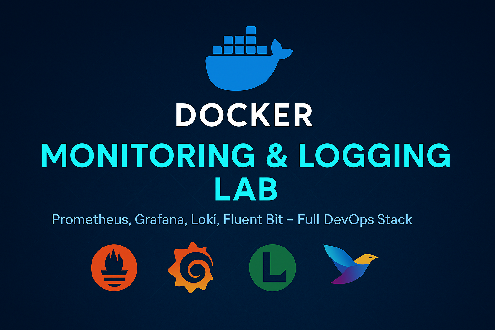

# 📦 Docker Monitoring + Logging Lab

[](https://www.docker.com/)
[](https://prometheus.io/)
[](https://grafana.com/)
[](https://grafana.com/oss/loki/)
[](https://fluentbit.io/)

---

## 📖 Overview

This project provides a **production-grade** hands-on lab to monitor, log, and alert on your Docker containers and host systems using:
- **Prometheus** (metrics collection)
- **Grafana** (visualization)
- **Loki** (logs aggregation)
- **Fluent Bit** (log shipper)
- **Alertmanager** (notifications via Email/Slack)

It follows **real-world DevOps standards** for microservice observability.

---

## 🖼️ Architecture

> *(Visual)*



---

## 🎯 Features

- 🔥 Auto-deploy Prometheus, Grafana, Loki, Fluent Bit, Node Exporter, cAdvisor
- 🔥 Centralized container logging with Loki + Fluent Bit
- 🔥 Host and Container Metrics via Node Exporter and cAdvisor
- 🔥 Grafana dashboards for host health, container metrics, and logs
- 🔥 Prometheus Alerts → Alertmanager → Email/Slack
- 🔥 Healthcheck monitoring with auto-restart watchdog
- 🔥 Fluent Bit filtering (capture only Errors/Warnings)

---

## 🛠️ Prerequisites

- Ubuntu 20.04/22.04 recommended
- Docker 20.10+ installed
- Docker Compose plugin installed
- Ports open: 3000, 9090, 9100, 8081, 3100, 9093, 8080, 2020
- SMTP and Slack webhook for alerts (optional)

---

## 🚀 How to Run

```bash
git clone https://github.com/mailsudiptabiswas/Master-Docker-from-Scratch-to-Scale.git
cd docker-monitoring-logging-lab
docker compose up -d --build
```

Access URLs:
- Grafana: http://localhost:3000
- Prometheus: http://localhost:9090
- Node Exporter: http://localhost:9100/metrics
- cAdvisor: http://localhost:8081/metrics
- Loki: http://localhost:3100
- App: http://localhost:8080

---

## 📈 Prebuilt Grafana Dashboards

- Docker Host Overview
- Container Metrics Overview
- Loki Log Explorer

---

## 🔥 Fluent Bit Queries

- `{job="fluent-bit"}` — All logs
- `{severity="detected"}` — Only Errors/Warnings

---

## 📩 Alerts

Alertmanager sends:
- Email Notifications
- Slack Notifications

---

## 📂 Folder Structure

```
/docker-monitoring-logging-lab/
├── docker-compose.yml
├── .env
├── prometheus/
│   ├── prometheus.yml
│   ├── alerts.yml
├── grafana/
│   ├── datasources/
│   │   ├── prometheus.yaml
│   │   └── loki.yaml
│   ├── dashboards/
│   │   ├── docker-host-overview.json
│   │   ├── container-metrics.json
│   │   └── loki-logs.json
├── loki/
│   ├── loki-config.yml
├── fluent-bit/ (optional)
│   ├── fluent-bit.conf
│   ├── parsers.conf
├── sample-app/
│   ├── Dockerfile
│   ├── app.js
│   └── package.json
├── scripts/
│   ├── docker_health_watchdog.sh
├── alertmanager/
│   ├── alertmanager.yml

```

---

## 📝 License

MIT License © 2025 Sudipta Biswas

---
